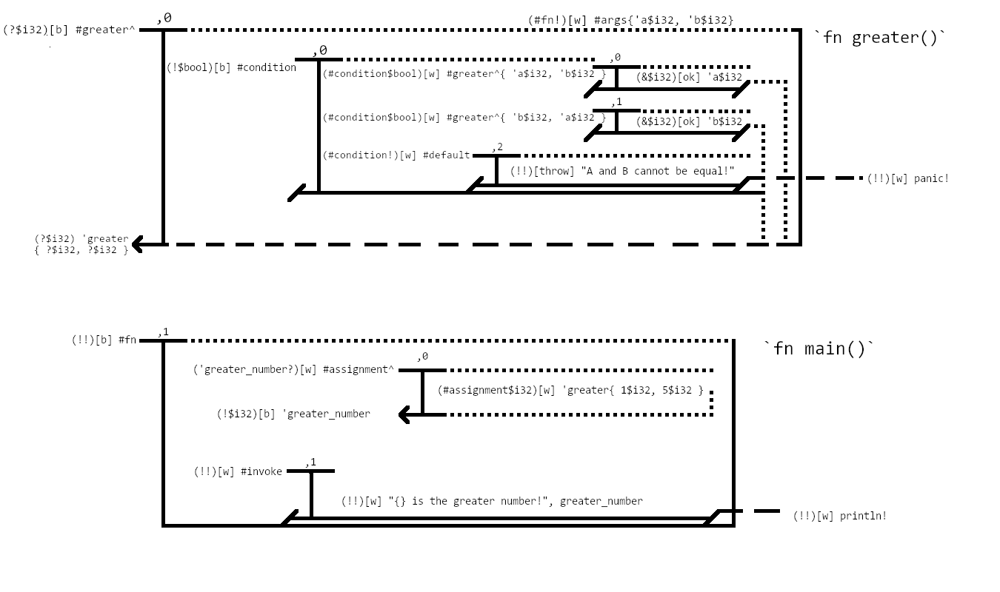

# What is a Binder?
The inverse to a value in most languages would be some identifying statement or storage position
for the value to exist in. In V2B parsing, this is known as a binder.  

Binders store an address for each symbols in the code declared within the current scope. 
Think of the relation between binders and views as a three-ringed binder containing pages.
Each of these pages relates to a greater subject, with their own parts contained within them, 
with the binder representing an appendix or table of contents for the entire three-ringed binder.
Each binder can nest binders underneath it, and each nested binder is within the same context as its
parent binder.

Refer to Figure 1a:

<i style="text-decoration: underline;">Figure 1a</i>

The area to the left of the border for the view at any point is referred to as the **binder area**. 
The binder area is the space in which declarations and definitions take place.  

Any definitions or declaration done in this space is a binder statement.

All binder statements have a correlated view with them. Binders are indexed by the symmetrical view index
they're associated with.

## Binder Symbols
There are two characters meant to classify a specific pool in which values and outputs and declarations can be
specified. These two characters are `#` (the Bin declarer, sometimes followed by the Functional Bin declarer),
and `'` (the Symbol declarer). These can both be followed by the functional binder declarer `^`.

The bin declarer `#` declares a group, or bin, that multiple statements will fit into. A bin is more of an
abstraction of a single statement or series of statements that can fit into a group based on necessary group criteria 
or as input into that group.

A functional bin declarer `^` declares a bin which represents an outcome of the entry of a series of view-bound inputs.
Functional bins are typically parser-defined/parser-side functions such as mathematical operations. This is because bins
are always predefined and are meant to break written code down into a series of collective statements.

There also exists the symbol declarer `'`, which declares a non-predefined bin for a value to fit into. 
Symbols are directly correlated to the variables and function names written in code. In Figure 1a, the `'greater` 
symbol is the name of the `greater` function in the original reference code.

Functional symbols `'...^` are typically associated with authored functions or package functions which have their own
symbols.

Pools will be discussed more in Chapter 2.