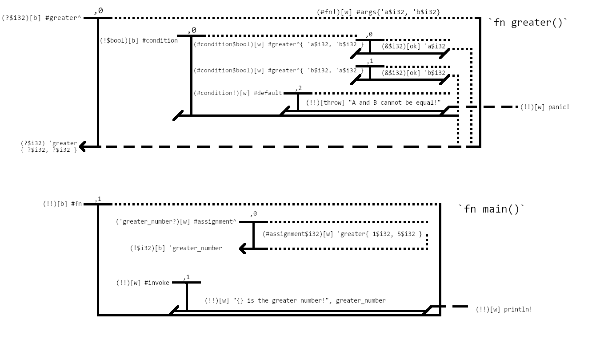

# What is a View?

Universally amongst programming languages exist values.

A view, at its core, is a look into some uncategorized value. These values can be as simple as an integer or float to
as complicated as the body of a function. 

The view gets its name from the original diagram created before the V2B parsing technique was created.

Figure 1a below is the source code that the diagram in Figure 1b is built from. 

<sub><i style="text-decoration: underline;">Figure 1a</i></sub>
```rust
fn greater(a: i32, b: i32) -> i32 {
    if a > b {                                          // a > b
        a
    } else if a < b {                                   // a < b
        b
    } else {                                            // none
        panic!("A and B cannot be equal!");
    }
}

fn main() {
    let greater_number = greater(1, 5);
    println!("{} is the greater number!", greater_number);
}
```

Now, take a look at Figure 1b:  

<sub><i style="text-decoration: underline;">Figure 1b</i></sub>



All the extra symbols and markings and words can be ignored for now. Instead, pay attention to the shape
of each "block". The inner pieces of each of those blocks is a view. A view may have multiple different views, 
declarations, statements, and more within it. 

These views do **not** include the lines that are surrounding them, only the inner pieces are part of the view. The
lines are viewbinder statements (covered in section 1.3).

--- 

## View Indexes

From here on out this guide is going to begin using the term _"view index"_. 

A view index is a matrix-like list of numbers specifying which point within the code the corresponding
view exists. 

View indexes would be important for parsing operations. Ideally, a parser which utilizes V2B would not redundantly
parse the same code each time changes are made, or functions are edited. Rather, it would utilize view indexes to update
specific code directly. 

All view indexes should start off with an asterisk (`*`). This asterisk specifies a globally scoped view (i.e. the 
contents of a file). There are only a few times this should change, which is when access modifiers are introduced, 
modifying the scope of the resulting view index. These access modifiers should be implemented by the author of the 
parser library or by a third party utilizing a library.

Best practice defined by this guide for the top-level view index would be:
- `*`: Unrestricted global access
- `PT`: Protected access
- `PV`: Private access
- `PB`: Public access

Another symbol will be used to refer to the highest-level parent index that is **not** within a top-level access index,
`&`. `&` is used to refer to the _"top-level, and then one down" (TL1D)_ view index. In the scope of the `greater` function
in Figure 1b, any view from within `greater` would refer to the root `greater` view index as `&` instead of 
`*0,0,...`.

Past the top-level view index lie further view indices. Refer to Figure 1b. The `greater` and `main` functions would 
lie at view indexes `*0` and `*1` respectively. The `greater` function has a multitude of different view indexes,
such as `*0,0` (or `&0`), `*0,0,0` (or `&0,0`), `*0,0,1`, and `*0,0,2`. Each of these view indexes are a direct
path to an executable block of code. Take for instance (from Figure 1a):

``` 
a > b {
    a
}
```

This code specifically lies at view index `*0,0,0`.

From here on, this book will refer to all view indexes in reference as their full paths. However, note that
pseudocode and diagrams will make many references to `&`. This is because of things like, for example,
return statements, which need to target their output upwards to the TL1D view.

---

## Closure and Resolution

The concept of closure refers to how a view concludes. (This is more of a viewbinder topic, however it's 
heavily dependent on the contents of the associated view). 

Refer back to Figure 1b:
<sub><i style="text-decoration: underline;">Figure 1b</i></sub>


On each viewbinder, the bottom border will always do one of the following:
- Close on each side with a slash.
  - This represents no value being resolved from the view.
  - This is referred to as _"closing"_.

- Close on the right side with a slash, resolve on the left with an arrow. 
  - This represents a value being resolved from the view.
  - This is referred to as _"resolving left"_.
  - _(Note there's currently a discrepancy in the 
  figure. The figure shows a dotted line at `*1,0` to the right. This should be a slash.)_

- Close on the left side with a slash, resolve on the right side with a dashed line that goes out of the view.
  - This represents a view which had no pool target specified. Pools, pool targets, and pool types will be covered
    more in depth in section 1.3 along with viewbinders, but for now think of this as making a function call which 
    returns a value, and not giving that value any place to go. Functions that also have a void return type should
    also resolve to the right out of scope, to avoid clogging up the binder to the left.
  - This is referred to as _"resolving right"_.

- Resolves on each side, to the left with an arrow and to the right with a dashed line.
  - This represents a view which specifies multiple targets. This is usually either a syntax error or a compiler error,
    except for in the case of things like mutable references to variables being modified within a function which
    returns a value (expects a pool target). 
  - This is referred to as _"resolving vertically"_.

- Closes on the left with a slash, resolves on the right with a dotted line going downwards towards a bottom viewbinder.
  - Represents a view which returns a value to some higher level view index, usually `&`. 
  - This is referred to as _"resolving downwards"_.